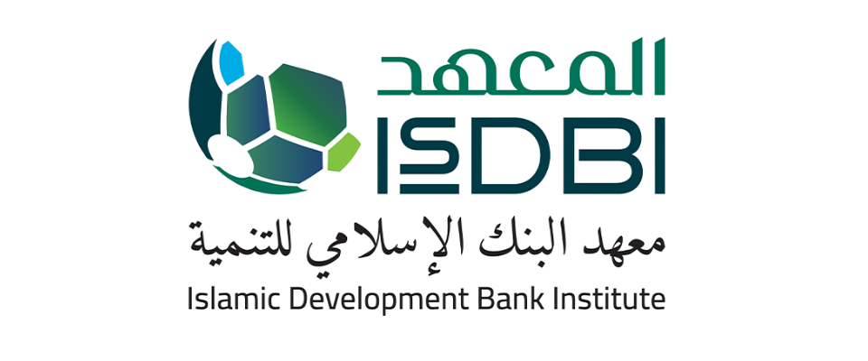
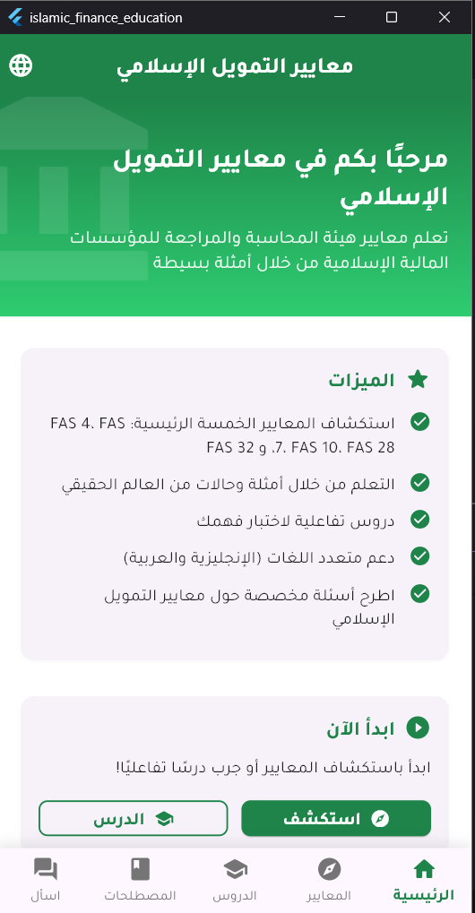
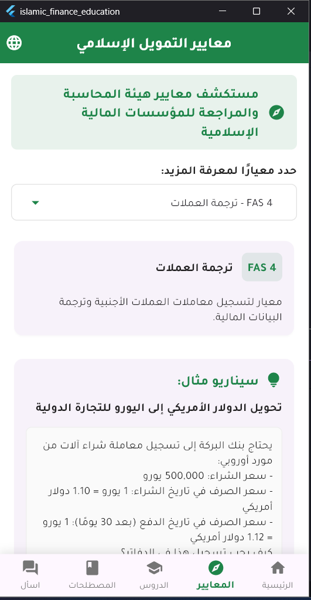
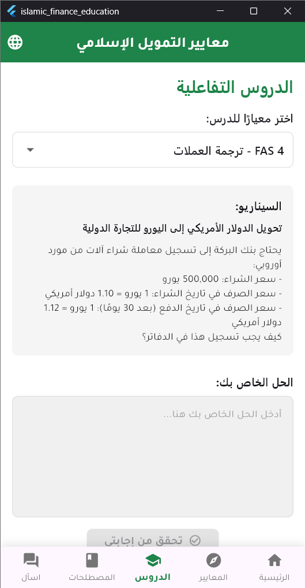
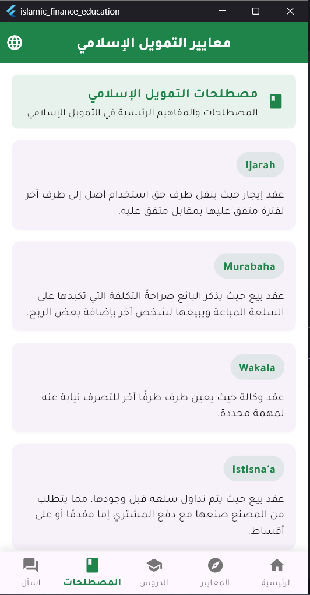

# Islamic Finance Educational App

<p align="center">
  
</p>

A comprehensive educational mobile application built with Flutter and Python that helps users learn about Islamic Finance Standards (AAOIFI). This app provides an interactive platform for exploring standards, understanding real-world examples, testing knowledge through tutorials, and accessing a glossary of Islamic finance terms.

## 📱 Screenshots

<p align="center">
  
  
  
  
</p>

## ✨ Features

- **Multilingual Support**: Full English and Arabic language support with proper RTL layout
- **Standards Explorer**: Browse and learn about key AAOIFI financial accounting standards
- **Interactive Tutorials**: Test your understanding with practical scenarios and get AI-powered feedback
- **Real-world Examples**: Learn through practical case studies for each standard
- **Comprehensive Glossary**: Access definitions of important Islamic finance terms
- **Custom Q&A**: Ask specific questions about Islamic finance and get AI-generated answers
- **Offline Mode**: Access core content even without an internet connection

## 🛠️ Technology Stack

### Frontend
- **Flutter**: Cross-platform UI framework
- **Provider**: State management
- **Google Fonts**: Typography with Tajawal font
- **Flutter Markdown**: Rendering markdown content
- **HTTP**: API communication
- **Shared Preferences**: Local storage

### Backend
- **FastAPI**: High-performance Python web framework
- **Together AI**: AI model integration for explanations and feedback
- **Python-dotenv**: Environment variable management
- **Uvicorn**: ASGI server

## 🚀 Getting Started

### Prerequisites
- Flutter SDK (2.19.0 or higher)
- Dart SDK
- Python 3.8 or higher
- Together AI API key

### Frontend Setup

1. Clone the repository:
   \`\`\`bash
   git clone https://github.com/yourusername/islamic-finance-app.git
   cd islamic-finance-app
   \`\`\`

2. Install Flutter dependencies:
   \`\`\`bash
   flutter pub get
   \`\`\`

3. Update the API base URL in `lib/providers/standard_provider.dart` if needed:
   ```dart
   String _apiBaseUrl = 'http://10.0.2.2:8000'; // For Android emulator
   // Use 'http://localhost:8000' for iOS simulator or web
   \`\`\`

4. Run the app:
   \`\`\`bash
   flutter run
   \`\`\`

### Backend Setup

1. Navigate to the backend directory:
   \`\`\`bash
   cd backend
   \`\`\`

2. Create a virtual environment:
   \`\`\`bash
   python -m venv venv
   \`\`\`

3. Activate the virtual environment:
   - On Windows:
     \`\`\`bash
     venv\Scripts\activate
     \`\`\`
   - On macOS/Linux:
     \`\`\`bash
     source venv/bin/activate
     \`\`\`

4. Install the required packages:
   \`\`\`bash
   pip install -r requirements.txt
   \`\`\`

5. Create a `.env` file in the backend directory with your Together AI API key:
   \`\`\`
   TOGETHER_API_KEY=your_together_ai_api_key_here
   \`\`\`

6. Populate the data files (if they don't exist):
   \`\`\`bash
   python populate_data.py
   \`\`\`

7. Run the backend server:
   \`\`\`bash
   uvicorn main:app --reload --host 0.0.0.0 --port 8000
   \`\`\`

## 📁 Project Structure

\`\`\`
islamic-finance-app/
├── lib/
│   ├── models/              # Data models
│   ├── providers/           # State management
│   ├── screens/             # UI screens
│   ├── widgets/             # Reusable UI components
│   └── main.dart            # App entry point
├── backend/
│   ├── data/                # JSON data files
│   ├── main.py              # FastAPI server
│   ├── populate_data.py     # Data initialization script
│   └── requirements.txt     # Python dependencies
└── pubspec.yaml             # Flutter dependencies
\`\`\`

## 📚 API Documentation

The backend provides the following RESTful API endpoints:

| Endpoint | Method | Description |
|----------|--------|-------------|
| `/api/standards` | GET | Get all Islamic finance standards |
| `/api/examples` | GET | Get all example scenarios |
| `/api/glossary` | GET | Get glossary terms and definitions |
| `/api/explanation` | POST | Get AI explanation for a standard and scenario |
| `/api/feedback` | POST | Get feedback on a user's solution |
| `/api/ask` | POST | Ask a custom question about Islamic finance |

## 🧠 AI Integration

This application uses Together AI's language models to provide intelligent responses. The app is configured to use the "mistralai/Mistral-7B-Instruct-v0.2" model by default, which is available through the serverless API.

## 📱 Device Compatibility

- Android 5.0 (API level 21) or higher
- iOS 11.0 or higher

## 🤝 Contributing

Contributions are welcome! Please feel free to submit a Pull Request.

1. Fork the repository
2. Create your feature branch (`git checkout -b feature/amazing-feature`)
3. Commit your changes (`git commit -m 'Add some amazing feature'`)
4. Push to the branch (`git push origin feature/amazing-feature`)
5. Open a Pull Request

## 📄 License

This project is licensed under the MIT License - see the LICENSE file for details.

## 🙏 Acknowledgements

- [AAOIFI](https://aaoifi.com/) for their standards and guidelines
- [Together AI](https://www.together.ai/) for their AI models
- [Flutter](https://flutter.dev/) and [FastAPI](https://fastapi.tiangolo.com/) communities for their excellent documentation and support
